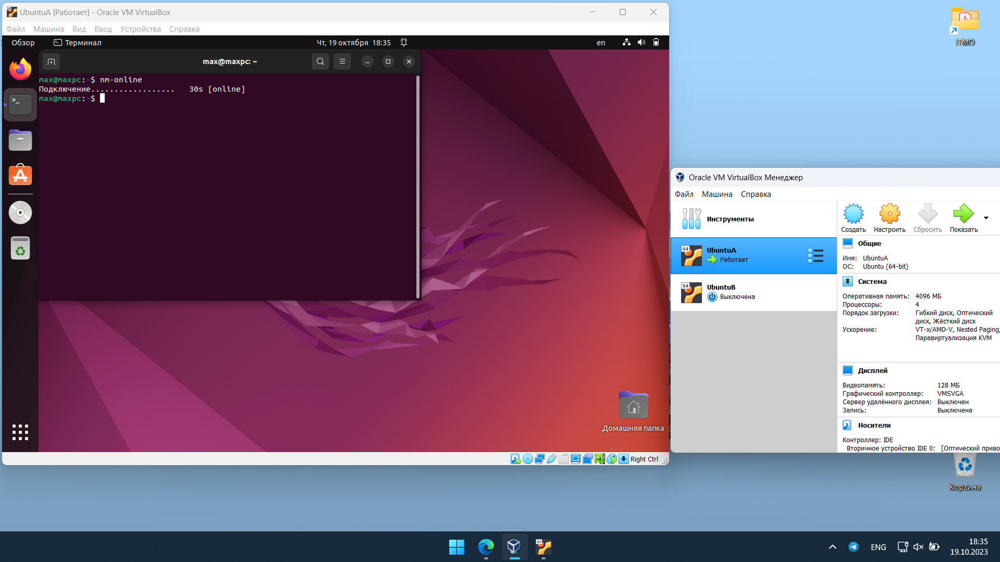
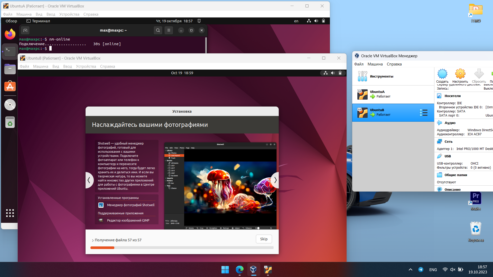
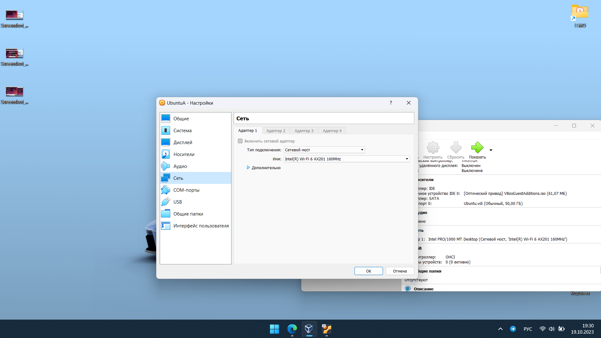
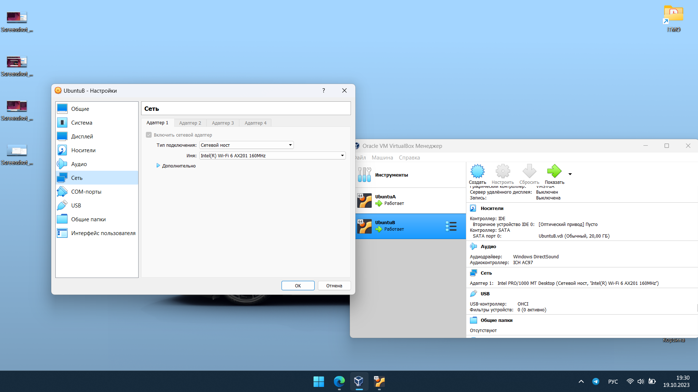
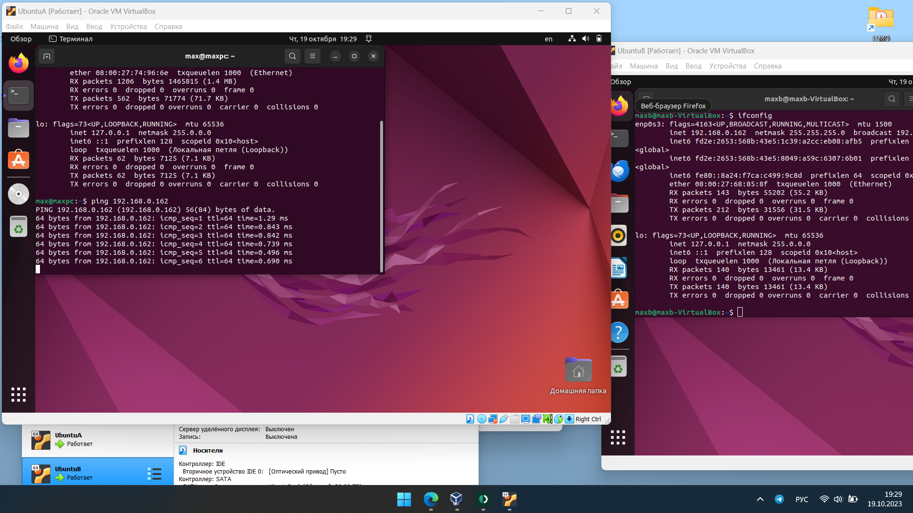
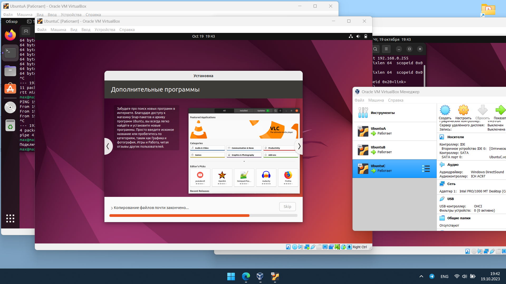
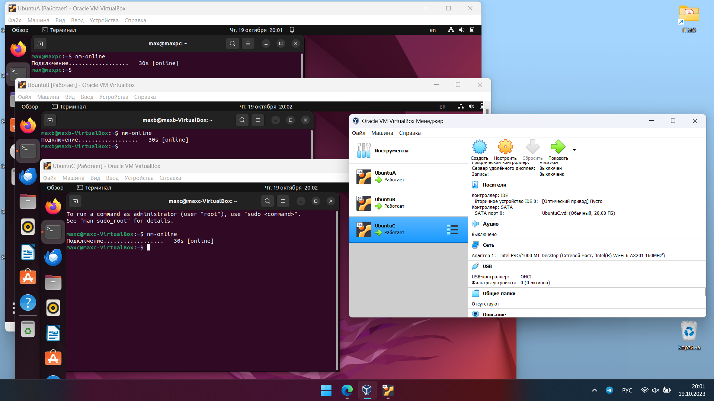
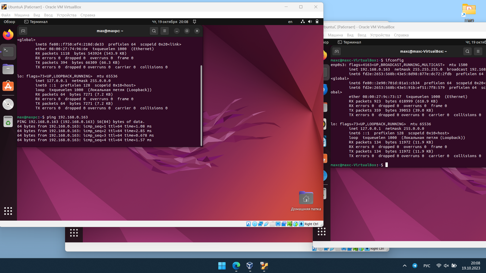
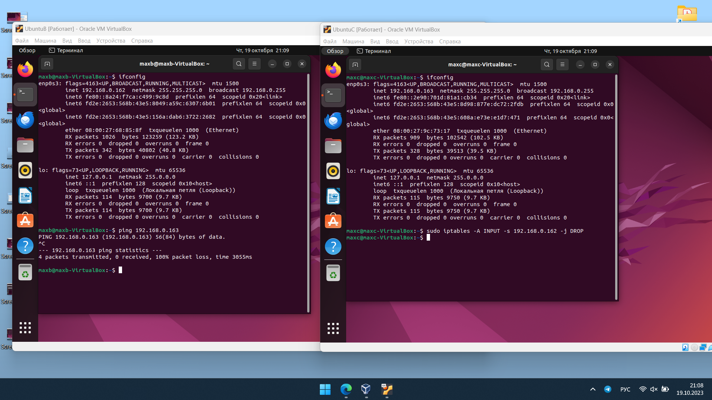
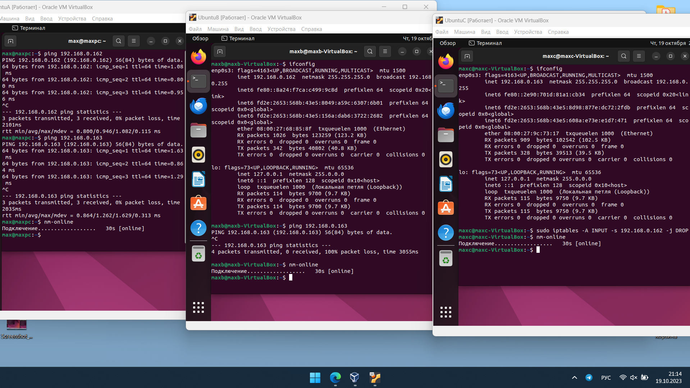

# Lab3
В начале я запустил первую виртуальную машину (UbuntuA) и проверил доступ в интернет командой `nm-online`:

После этого установил вторую машину - UbuntuB:

В настройках обеих машин был установлен тип подключения "Сетевой мост":

Далее, с помощью команды `ifconfig` я узнал IP-адреса виртуальных машин и проверил сетевой доступ из машины А в машину Б командой `ping 192.168.0.162`:

После этого установил третью машину (UbuntuC) с аналогичными настройками сети - UbuntuC:

Проверка подключения к интернету на всех машинах:

IP-адреса всех машин:

А - 192.168.0.161;

Б - 192.168.0.162;

В - 192.168.0.163.

Проверка сетевого доступа из машины А в машину В:

Для настройки сетевого доступа использовалась утилита iptables.
С помощью команды `sudo iptables -A INPUT -s 192.168.0.162 -j DROP` на машине В был запрещён доступ к ней из машины Б. Если подробнее, то эта команда добавляет правило в цепь INPUT, которое отбрасывает все входящие пакеты, пришедшие с 192.168.0.162:

Терминалы всех трёх машин:

